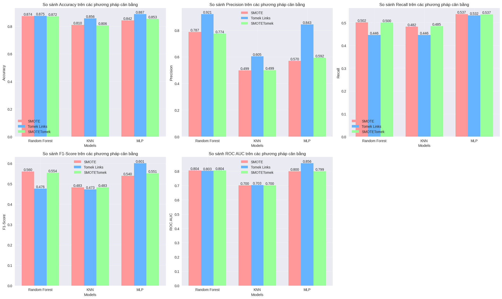
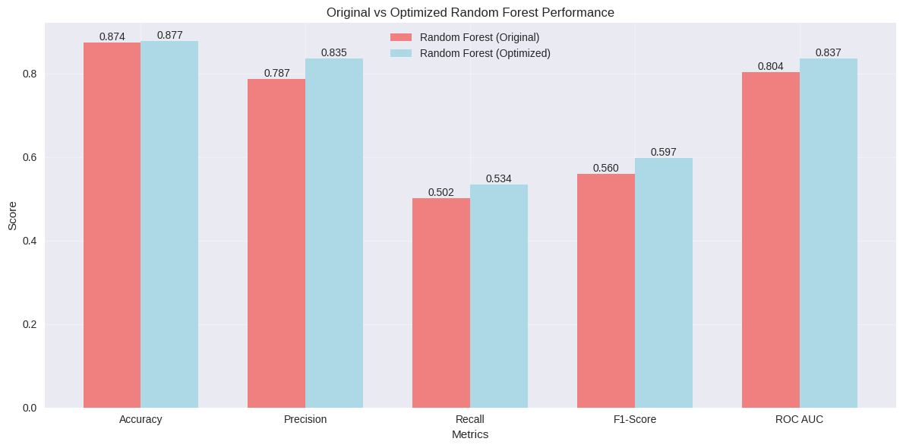
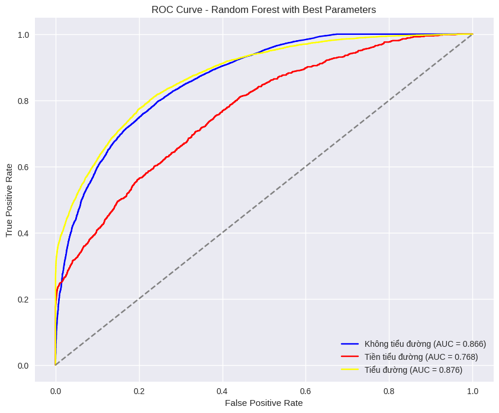
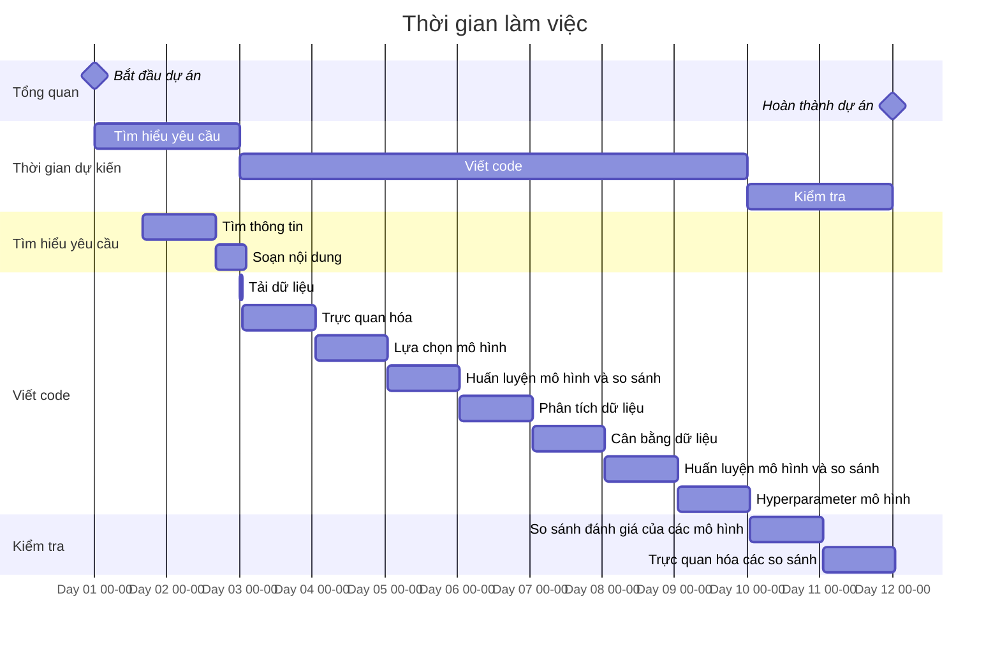

# **Dự đoán Bệnh Tiểu đường bằng Machine Learning**

## **0. Giới thiệu**

Trong lĩnh vực chăm sóc sức khỏe, việc phát hiện và phòng ngừa sớm đóng vai trò then chốt trong việc kiểm soát các tình trạng mãn tính và cải thiện kết quả của bệnh nhân. **Đái tháo đường** hay **tiểu đường**[^1] là một nhóm các rối loạn chuyển hóa đặc trưng là tình trạng đường huyết cao kéo dài, đây là một bệnh phổ biến gây những rủi ro đáng kể nếu không được điều trị kịp thời. Trong bối cảnh khoa học phát triển, việc tích hợp các kỹ thuật học máy hứa hẹn sẽ cách mạng hóa các hoạt động chăm sóc sức khỏe, đặc biệt là trong phân tích và dự đoán.

    
    
<i>Bệnh tiểu đường là bệnh phổ biến trong xã hội</i>

Bệnh tiểu đường đang là một trong những vấn đề sức khỏe nghiêm trọng trên toàn cầu. Theo **Centers for Disease Control and Prevention (CDC)** công bố ước tính trong năm 2021, có khoảng 38.1 triệu người trưởng thành từ 18 tuổi trở lên - 14.7% tổng số người trưởng thành ở Hoa Kỳ mắc bệnh tiểu đường. Con số này đã tăng lên theo thời gian. Năm 2010, 29,1 triệu người trưởng thành ở Hoa Kỳ mắc bệnh tiểu đường, tương đương 9,3% dân số trưởng thành [^2].

    
    
<i>Ứng dụng của trí tuệ nhân tạo vào dự đoán bệnh tiểu đường</i>

Dự án này tập trung vào việc ứng dụng **Machine Learning**[^3] tập trung vào việc phân tích các yếu tố nguy cơ và xây dựng một hệ thống dự đoán khả năng mắc bệnh tiểu đường dựa trên bộ dữ liệu từ **Behavioral Risk Factor Surveillance System (BRFSS)** năm 2021 của CDC cung cấp và được trích xuất từ hơn 300 đặc trưng để tạo ra bộ dữ liệu này.

**Behavioral Risk Factor Surveillance System (BRFSS)** là một cuộc khảo sát qua điện thoại nhằm thu thập dữ liệu về các hành vi rủi ro liên quan đến sức khỏe, tình trạng sức khỏe mãn tính và việc sử dụng các dịch vụ phòng ngừa ở người lớn từ 18 tuổi trở lên cư trú tại Hoa Kỳ. Được thực hiện hàng năm bởi CDC, BRFSS đã cung cấp những hiểu biết sâu sắc có giá trị về tình trạng sức khỏe và hành vi của người trưởng thành ở Hoa Kỳ kể từ khi thành lập vào năm 1984.

    
    
<i>Behavioral Risk Factor Surveillance System (BRFSS)</i>

---

## **1. Dữ liệu**

Đối với tập dữ liệu này, đây là các file csv của tập dữ liệu BRFSS 2021 có trên **Kaggle** đã được sử dụng. Tập dữ liệu gốc chứa phản hồi từ 438.693 cá nhân và có 303 đặc điểm. Các feature này là các câu hỏi được đặt ra trực tiếp cho người tham gia hoặc các biến được tính toán dựa trên phản hồi của từng người tham gia. Bộ dữ liệu này sẽ gồm có 3 file là:

- `diabetes_012_health_indicators_BRFSS2021.csv` là một tập dữ liệu rõ ràng gồm 236.378 câu trả lời khảo sát theo BRFSS2021 của CDC. Có sự mất cân bằng giữa các lớp trong tập dữ liệu này. Tập dữ liệu này có 21 feature.. Biến mục tiêu `Diabetes_012` có 3 class.
  - 0 là không mắc bệnh tiểu đường.
  - 1 là tiền tiểu đường.
  - 2 là bệnh tiểu đường.
- `diabetes_binary_5050split_health_indicators_BRFSS2021.csv` là một tập dữ liệu sạch gồm 67.136 câu trả lời khảo sát cho BRFSS2021 của CDC. Tỷ lệ người trả lời không mắc bệnh tiểu đường và mắc tiểu đường là 50-50. Tập dữ liệu này có 21 biến đặc trưng và được cân bằng sẵn. Biến mục tiêu `Diabetes_binary` có 2 class:
  - 0 là không mắc bệnh tiểu đường.
  - 1 là tiền tiểu đường hoặc tiểu đường.
- `diabetes_binary_health_indicators_BRFSS2021.csv` là một tập dữ liệu rõ ràng gồm 236.378 câu trả lời khảo sát theo BRFSS2021 của CDC. Tập dữ liệu này có 21 biến đặc trưng và không cân bằng. Biến mục tiêu `Diabetes_binary` có 2 class:
  - 0 là không mắc bệnh tiểu đường.
  - 1 là tiền tiểu đường hoặc tiểu đường.

Trong dự án này, chúng ta sẽ sử dụng bộ dữ liệu `diabetes_012_health_indicators_BRFSS2021`, vì đây là một bộ dữ liệu có đầy đủ các record để giúp mô hình học tốt hơn, ngoài ra bộ dữ liệu này có các class chi tiết hơn so với 2 bộ lại. Bộ dữ liệu này đặc biệt thú vị vì nó không chỉ phân loại người bệnh thành hai nhóm (có/không có tiểu đường) mà còn bao gồm cả giai đoạn tiền tiểu đường (Có khả năng bị tiểu đường). Điều này cho phép chúng ta có cái nhìn chi tiết hơn về quá trình phát triển của bệnh và các yếu tố ảnh hưởng.

- **Tên tệp**: `diabetes_012_health_indicators_BRFSS2021.csv`
- **Số lượng mẫu**: 236,378
- **Số lượng cột**: 22
- **Mục tiêu**: Cột `Diabetes_012` (0: Không bị tiểu đường, 1: Tiền tiểu đường, 2: Tiểu đường).
- **Các cột đặc trưng**: Bao gồm chỉ số BMI, huyết áp cao, cholesterol, hoạt động thể chất, và các yếu tố nhân khẩu học như tuổi, giới tính, thu nhập, v.v.

Bảng mô tả ý nghĩa các cột:

| Tên cột | Mô tả |
|---------|--------|
| Diabetes_012 | Tình trạng tiểu đường (0: không, 1: tiền tiểu đường, 2: tiểu đường) |
| HighBP | Huyết áp cao (0: không, 1: có) |
| HighChol | Cholesterol cao (0: không, 1: có) |
| CholCheck | Kiểm tra Cholesterol trong 5 năm qua (0: không, 1: có) |
| BMI | Chỉ số khối cơ thể |
| Smoker | Đã từng hút thuốc ít nhất 100 điếu trong đời (0: không, 1: có) |
| Stroke | Đã từng bị đột quỵ (0: không, 1: có) |
| HeartDiseaseorAttack | Đã từng mắc bệnh tim hoặc đau tim (0: không, 1: có) |
| PhysActivity | Hoạt động thể chất trong 30 ngày qua (0: không, 1: có) |
| Fruits | Ăn trái cây ít nhất 1 lần/ngày (0: không, 1: có) |
| Veggies | Ăn rau ít nhất 1 lần/ngày (0: không, 1: có) |
| HvyAlcoholConsump | Uống rượu bia nặng (nam >14 ly/tuần, nữ >7 ly/tuần) (0: không, 1: có) |
| AnyHealthcare | Có bất kỳ bảo hiểm y tế nào (0: không, 1: có) |
| NoDocbcCost | Không đi khám bác sĩ vì chi phí trong 12 tháng qua (0: không, 1: có) |
| GenHlth | Đánh giá sức khỏe tổng quát (1-5: xuất sắc đến kém) |
| MentHlth | Số ngày sức khỏe tâm thần không tốt trong 30 ngày qua (0-30) |
| PhysHlth | Số ngày sức khỏe thể chất không tốt trong 30 ngày qua (0-30) |
| DiffWalk | Khó khăn khi đi bộ hoặc leo cầu thang (0: không, 1: có) |
| Sex | Giới tính (0: nữ, 1: nam) |
| Age | Nhóm tuổi (1: 18-24, 2: 25-29, ..., 13: 80+ tuổi) |
| Education | Trình độ học vấn (1: chưa tốt nghiệp cấp 3, 2: tốt nghiệp cấp 3, 3: học một số đại học, 4: tốt nghiệp đại học) |
| Income | Thu nhập hàng năm (1: dưới $10,000, 2: $10,000-$15,000, ..., 8: $75,000+) |

---

Dựa vào nội dung notebook, tôi sẽ giúp điều chỉnh phần mục tiêu dự án trong README của bạn như sau:

## **2. Mục tiêu dự án**

1. **Tiền xử lý và Phân tích dữ liệu**:
   - Làm sạch và xử lý dữ liệu ban đầu
   - Xử lý outliers cho các chỉ số quan trọng như BMI, MentHlth, PhysHlth
   - Phân tích tương quan giữa các biến
   - Thực hiện feature engineering để tạo các đặc trưng mới:
     - Chỉ số sức khỏe tổng hợp (HealthScore)
     - Chỉ số rủi ro (RiskScore)  
     - Chỉ số lối sống lành mạnh (HealthyLifestyle)
     - Chỉ số rủi ro tim mạch (CardioRisk)

2. **Cân bằng dữ liệu**:
   - So sánh và áp dụng 3 phương pháp cân bằng dữ liệu:
     - SMOTE (Synthetic Minority Over-sampling Technique)
     - Tomek Links
     - SMOTETomek (kết hợp)
   - Đánh giá hiệu quả của từng phương pháp

3. **Xây dựng và huấn luyện mô hình**:
   - Thử nghiệm 3 mô hình machine learning:
     - Random Forest Classifier
     - K-Nearest Neighbors
     - Multi-layer Perceptron
   - Đánh giá và so sánh hiệu suất các mô hình trên các bộ dữ liệu cân bằng khác nhau
   - Tối ưu hóa hyperparameter cho mô hình tốt nhất

4. **Đánh giá mô hình**:
   - Sử dụng các metrics:
     - Accuracy
     - Precision
     - Recall
     - F1-score
     - ROC-AUC
   - So sánh kết quả trước và sau khi thực hiện feature engineering
   - Phân tích chi tiết khả năng dự đoán cho từng nhóm bệnh nhân

Dự án nhằm mục đích xây dựng một hệ thống dự đoán nguy cơ mắc bệnh tiểu đường dựa trên các chỉ số sức khỏe và thói quen sinh hoạt, giúp phát hiện sớm và có biện pháp phòng ngừa kịp thời.

---

## **3. Công cụ và thư viện sử dụng**

- **Ngôn ngữ lập trình**: Python
- **Thư viện xử lý dữ liệu**:
  - pandas
  - numpy
- **Thư viện trực quan hóa**:
  - matplotlib
  - seaborn
- **Thư viện Machine Learning**:
  - scikit-learn
  - imbalanced-learn
- **Công cụ lưu trữ mô hình**:
  - joblib

---

## **4. Kết quả đạt được**

### **4.1. Cải thiện chất lượng dữ liệu**

- Xử lý thành công outliers cho các chỉ số BMI, MentHlth, PhysHlth mà vẫn giữ được ý nghĩa y tế
- Tạo được các đặc trưng mới có độ tương quan cao với biến mục tiêu:
  - HlthScore (0.340)
  - CardioRisk (0.320)
  - RiskScore (0.315)

### **4.2 So sánh hiệu quả các phương pháp cân bằng dữ liệu**

    
    
<i>Biểu đồ so sánh hiệu suất của các mô hình trên 3 phương pháp cân bằng dữ liệu</i>

Tomek Links cho kết quả tốt nhất với:

- Accuracy: 88.74%
- Precision: 84.31%
- F1-score: 60.13%

### **4.3 Hiệu suất mô hình cuối cùng**

    
    
<i>Biểu đồ so sánh hiệu suất trước và sau khi tối ưu Random Forest</i>

Random Forest với tham số tối ưu đạt kết quả tốt nhất:

- Accuracy: 87.70%
- Precision: 83.55%
- Recall: 53.43%
- F1-score: 59.72%
- ROC-AUC: 83.66%

### **4.4 Đường cong ROC cho mô hình tốt nhất**

    
    
<i>Đường cong ROC của mô hình Random Forest tối ưu</i>

---

## **5. Ý nghĩa thực tiễn**

- Mô hình có khả năng phân loại tốt 3 nhóm: không mắc bệnh, tiền tiểu đường và tiểu đường
- Xác định được các yếu tố quan trọng ảnh hưởng đến nguy cơ mắc bệnh:
  - Tình trạng sức khỏe thể chất
  - Chỉ số sức khỏe tổng hợp
  - Các yếu tố rủi ro tim mạch
- Có thể ứng dụng trong sàng lọc sớm và đánh giá nguy cơ mắc bệnh tiểu đường

---

## **6. Mở rộng trong tương lai**

- Tích hợp thêm dữ liệu từ các nguồn khác.
- Áp dụng các mô hình học sâu (Deep Learning).
- Xây dựng API cho dự án.

---

---

[^1]: Bệnh viện Đa khoa Tâm Anh, "Đái tháo đường: Nguyên nhân, dấu hiệu, chẩn đoán, cách phân loại", Tam Anh Hospital, 07/06/2021, available: <https://tamanhhospital.vn/dai-thao-duong/>
[^2]: U.S. Centers for Disease Control and Prevention (CDC), "National Diabetes Statistics Report", Centers for Disease Control and Prevention, 15/05/2024, available: <https://s.net.vn/4l00>
[^3]: GeeksforGeeks, "What is Machine Learning?", GeeksforGeeks, 26/5/2024,
available: <https://www.geeksforgeeks.org/ml-machine-learning/>
