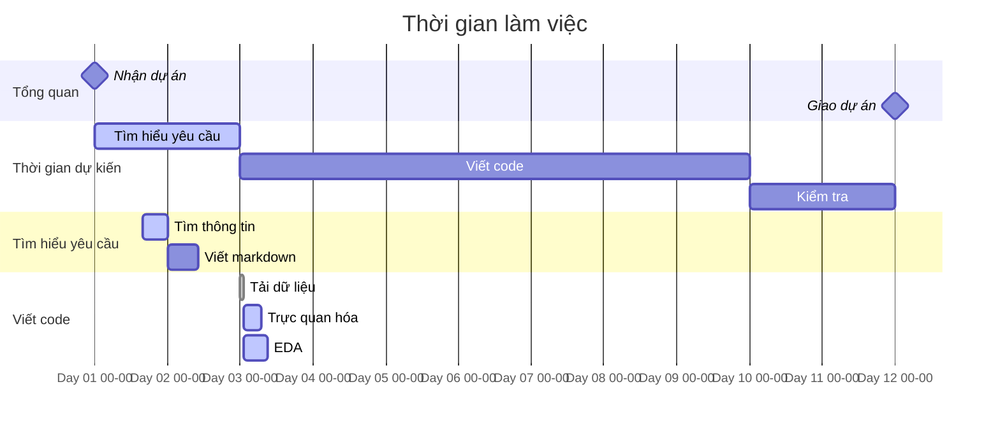

# **Dự đoán Bệnh Tiểu đường bằng Machine Learning**

## **0. Giới thiệu**

Trong lĩnh vực chăm sóc sức khỏe, việc phát hiện và phòng ngừa sớm đóng vai trò then chốt trong việc kiểm soát các tình trạng mãn tính và cải thiện kết quả của bệnh nhân. **Đái tháo đường** hay **tiểu đường**[^1] là một nhóm các rối loạn chuyển hóa đặc trưng là tình trạng đường huyết cao kéo dài, đây là một bệnh phổ biến gây những rủi ro đáng kể nếu không được điều trị kịp thời. Trong bối cảnh khoa học phát triển, việc tích hợp các kỹ thuật học máy hứa hẹn sẽ cách mạng hóa các hoạt động chăm sóc sức khỏe, đặc biệt là trong phân tích và dự đoán.

<div style="display: flex; justify-content: center">
    
</div>

Bệnh tiểu đường đang là một trong những vấn đề sức khỏe nghiêm trọng trên toàn cầu. Theo **Centers for Disease Control and Prevention (CDC)** công bố ước tính trong năm 2021, có khoảng 38.1 triệu người trưởng thành từ 18 tuổi trở lên - 14.7% tổng số người trưởng thành ở Hoa Kỳ mắc bệnh tiểu đường. Con số này đã tăng lên theo thời gian. Năm 2010, 29,1 triệu người trưởng thành ở Hoa Kỳ mắc bệnh tiểu đường, tương đương 9,3% dân số trưởng thành [^2].

<div style="display: flex; justify-content: center">
    
</div>

Dự án này tập trung vào việc ứng dụng **Machine Learning**[^3] tập trung vào việc phân tích các yếu tố nguy cơ và xây dựng một hệ thống dự đoán khả năng mắc bệnh tiểu đường dựa trên bộ dữ liệu từ **Behavioral Risk Factor Surveillance System (BRFSS)** năm 2021 của CDC cung cấp và được trích xuất từ hơn 300 đặc trưng để tạo ra bộ dữ liệu này.

**Behavioral Risk Factor Surveillance System (BRFSS)** là một cuộc khảo sát qua điện thoại nhằm thu thập dữ liệu về các hành vi rủi ro liên quan đến sức khỏe, tình trạng sức khỏe mãn tính và việc sử dụng các dịch vụ phòng ngừa ở người lớn từ 18 tuổi trở lên cư trú tại Hoa Kỳ. Được thực hiện hàng năm bởi CDC, BRFSS đã cung cấp những hiểu biết sâu sắc có giá trị về tình trạng sức khỏe và hành vi của người trưởng thành ở Hoa Kỳ kể từ khi thành lập vào năm 1984.

<div style="display: flex; justify-content: center">
    
</div>

---

## **1. Dữ liệu**

Đối với tập dữ liệu này, đây là các file csv của tập dữ liệu BRFSS 2021 có trên **Kaggle** đã được sử dụng. Tập dữ liệu gốc chứa phản hồi từ 438.693 cá nhân và có 303 đặc điểm. Các feature này là các câu hỏi được đặt ra trực tiếp cho người tham gia hoặc các biến được tính toán dựa trên phản hồi của từng người tham gia. Bộ dữ liệu này sẽ gồm có 3 file là:

- `diabetes_012_health_indicators_BRFSS2021.csv` là một tập dữ liệu rõ ràng gồm 236.378 câu trả lời khảo sát theo BRFSS2021 của CDC. Có sự mất cân bằng giữa các lớp trong tập dữ liệu này. Tập dữ liệu này có 21 feature.. Biến mục tiêu `Diabetes_012` có 3 class.
  - 0 là không mắc bệnh tiểu đường.
  - 1 là tiền tiểu đường.
  - 2 là bệnh tiểu đường.
- `diabetes_binary_5050split_health_indicators_BRFSS2021.csv` là một tập dữ liệu sạch gồm 67.136 câu trả lời khảo sát cho BRFSS2021 của CDC. Tỷ lệ người trả lời không mắc bệnh tiểu đường và mắc tiểu đường là 50-50. Tập dữ liệu này có 21 biến đặc trưng và được cân bằng sẵn. Biến mục tiêu `Diabetes_binary` có 2 class:
  - 0 là không mắc bệnh tiểu đường.
  - 1 là tiền tiểu đường hoặc tiểu đường.
- `diabetes_binary_health_indicators_BRFSS2021.csv` là một tập dữ liệu rõ ràng gồm 236.378 câu trả lời khảo sát theo BRFSS2021 của CDC. Tập dữ liệu này có 21 biến đặc trưng và không cân bằng. Biến mục tiêu `Diabetes_binary` có 2 class:
  - 0 là không mắc bệnh tiểu đường.
  - 1 là tiền tiểu đường hoặc tiểu đường.

Trong dự án này, chúng ta sẽ sử dụng bộ dữ liệu `diabetes_012_health_indicators_BRFSS2021`, vì đây là một bộ dữ liệu có đầy đủ các record để giúp mô hình học tốt hơn, ngoài ra bộ dữ liệu này có các class chi tiết hơn so với 2 bộ lại. Bộ dữ liệu này đặc biệt thú vị vì nó không chỉ phân loại người bệnh thành hai nhóm (có/không có tiểu đường) mà còn bao gồm cả giai đoạn tiền tiểu đường (Có khả năng bị tiểu đường). Điều này cho phép chúng ta có cái nhìn chi tiết hơn về quá trình phát triển của bệnh và các yếu tố ảnh hưởng.

- **Tên tệp**: `diabetes_012_health_indicators_BRFSS2021.csv`
- **Số lượng mẫu**: 236,378
- **Số lượng cột**: 22
- **Mục tiêu**: Cột `Diabetes_012` (0: Không bị tiểu đường, 1: Tiền tiểu đường, 2: Tiểu đường).
- **Các cột đặc trưng**: Bao gồm chỉ số BMI, huyết áp cao, cholesterol, hoạt động thể chất, và các yếu tố nhân khẩu học như tuổi, giới tính, thu nhập, v.v.

Bảng mô tả ý nghĩa các cột:

| Tên cột | Mô tả |
|---------|--------|
| Diabetes_012 | Tình trạng tiểu đường (0: không, 1: tiền tiểu đường, 2: tiểu đường) |
| HighBP | Huyết áp cao (0: không, 1: có) |
| HighChol | Cholesterol cao (0: không, 1: có) |
| CholCheck | Kiểm tra Cholesterol trong 5 năm qua (0: không, 1: có) |
| BMI | Chỉ số khối cơ thể |
| Smoker | Đã từng hút thuốc ít nhất 100 điếu trong đời (0: không, 1: có) |
| Stroke | Đã từng bị đột quỵ (0: không, 1: có) |
| HeartDiseaseorAttack | Đã từng mắc bệnh tim hoặc đau tim (0: không, 1: có) |
| PhysActivity | Hoạt động thể chất trong 30 ngày qua (0: không, 1: có) |
| Fruits | Ăn trái cây ít nhất 1 lần/ngày (0: không, 1: có) |
| Veggies | Ăn rau ít nhất 1 lần/ngày (0: không, 1: có) |
| HvyAlcoholConsump | Uống rượu bia nặng (nam >14 ly/tuần, nữ >7 ly/tuần) (0: không, 1: có) |
| AnyHealthcare | Có bất kỳ bảo hiểm y tế nào (0: không, 1: có) |
| NoDocbcCost | Không đi khám bác sĩ vì chi phí trong 12 tháng qua (0: không, 1: có) |
| GenHlth | Đánh giá sức khỏe tổng quát (1-5: xuất sắc đến kém) |
| MentHlth | Số ngày sức khỏe tâm thần không tốt trong 30 ngày qua (0-30) |
| PhysHlth | Số ngày sức khỏe thể chất không tốt trong 30 ngày qua (0-30) |
| DiffWalk | Khó khăn khi đi bộ hoặc leo cầu thang (0: không, 1: có) |
| Sex | Giới tính (0: nữ, 1: nam) |
| Age | Nhóm tuổi (1: 18-24, 2: 25-29, ..., 13: 80+ tuổi) |
| Education | Trình độ học vấn (1: chưa tốt nghiệp cấp 3, 2: tốt nghiệp cấp 3, 3: học một số đại học, 4: tốt nghiệp đại học) |
| Income | Thu nhập hàng năm (1: dưới $10,000, 2: $10,000-$15,000, ..., 8: $75,000+) |

---

(Tạm thời)

## Mục tiêu dự án

1. **Tiền xử lý dữ liệu**:
   - Làm sạch và chuẩn hóa dữ liệu.
   - Xử lý mất cân bằng dữ liệu bằng nhiều thuật toán khác nhau.
   - Tăng cường dữ liệu (Data Augmentation).

2. **Phân tích dữ liệu thăm dò (EDA)**:
   - Khám phá mối quan hệ giữa các biến đặc trưng.
   - Trực quan hóa dữ liệu bằng các biểu đồ.

3. **Xây dựng và huấn luyện mô hình**:
   - Chọn 3 mô hình máy học phù hợp dựa trên EDA.
   - Huấn luyện mô hình trên các tập dữ liệu đã xử lý.
   - Áp dụng thuật toán **AdaBoosting** để cải thiện hiệu suất.

4. **Xây dựng website**:
   - Dùng Spark và Plotly để trực quan hóa dữ liệu và kết quả EDA.
   - Cung cấp giao diện mô phỏng quá trình phân tích và dự đoán.

---

## Công cụ và thư viện sử dụng

- **Ngôn ngữ lập trình**: Python
- **Thư viện chính**:
  - `sklearn`, `pandas`, `numpy`, `matplotlib`, `seaborn` (Xử lý dữ liệu và xây dựng mô hình).
  - `spark`, `plotly` (Xây dựng website và trực quan hóa dữ liệu).

---

## Cách sử dụng

### 1. Cài đặt

```bash
# Tạo môi trường ảo
python -m venv env
source env/bin/activate  # Trên Linux/Mac
env\Scripts\activate   # Trên Windows

# Cài đặt các thư viện
pip install -r requirements.txt
```

### 2. Chạy dự án

- **Huấn luyện mô hình**:

```bash
python train_models.py
```

- **Khởi chạy website**:

```bash
python app.py
```

---

## Kỳ vọng kết quả

- **Hiệu suất mô hình**:
  - Đạt độ chính xác trên 85%.
  - Các chỉ số quan trọng: F1-score, ROC-AUC.
- **Giao diện website**:
  - Cung cấp trực quan hóa dễ hiểu.
  - Mô phỏng chi tiết từng bước phân tích dữ liệu.

---

## Thách thức và giải pháp

1. **Mất cân bằng dữ liệu**:
   - Sử dụng các kỹ thuật như SMOTE, under-sampling, over-sampling.
2. **Hiệu suất mô hình**:
   - Tối ưu hóa hyperparameters.
   - Áp dụng AdaBoosting để cải thiện kết quả.

---

## Mở rộng trong tương lai

- Tích hợp thêm dữ liệu từ các nguồn khác.
- Áp dụng các mô hình học sâu (Deep Learning).
- Xây dựng API cho dự án.

---

## Bản quyền

Dự án này được phát triển cho mục đích học tập và nghiên cứu. Mọi đóng góp hoặc sử dụng lại vui lòng ghi nguồn.

---


```mermaid
gantt
   title Thời gian làm việc
   dateFormat YYYY-MM-DD HH:MM
   axisFormat Day %d %H-%M
   todayMarker off

   section Tổng quan     
      Nhận dự án              :milestone, m1, 2025-01-01, 0d
      Giao dự án              :milestone, m2, 2025-01-12, 0d
      
   section Thời gian dự kiến
      Tìm hiểu yêu cầu        :active, a1, 2025-01-01, 2d
      Viết code               :a2, after a1, 7d
      Kiểm tra                :a3, after a2, 2d

   section Tìm hiểu yêu cầu
      Tìm thông tin           :active, b1, 2025-01-01 16:00, 8h
      Viết markdown           :after b1, 10h

   section Viết code
      Tải dữ liệu             :done, c1, 2025-01-03, 1h
      Trực quan hóa           :active, c2, after c1, 6h
      EDA                     :active, c3, after c1, 8h
```

---

[^1]: Bệnh viện Đa khoa Tâm Anh, "Đái tháo đường: Nguyên nhân, dấu hiệu, chẩn đoán, cách phân loại", Tam Anh Hospital, 07/06/2021, available: <https://tamanhhospital.vn/dai-thao-duong/>
[^2]: U.S. Centers for Disease Control and Prevention (CDC), "National Diabetes Statistics Report", Centers for Disease Control and Prevention, 15/05/2024, available: <https://s.net.vn/4l00>
[^3]: GeeksforGeeks, "What is Machine Learning?", GeeksforGeeks, 26/5/2024,
available: <https://www.geeksforgeeks.org/ml-machine-learning/>
